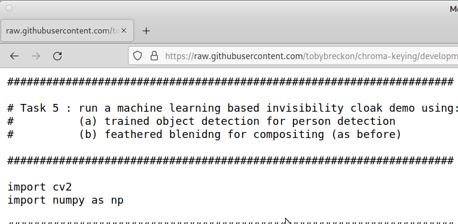
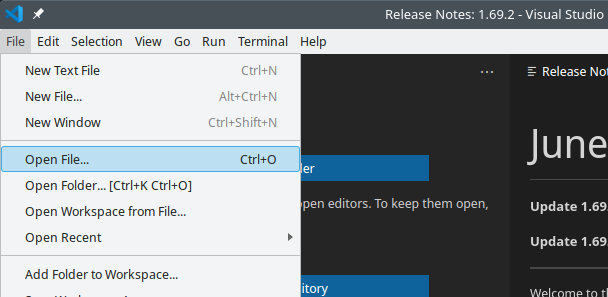

# Invisibility Cloaking via Real-time Object Detection in Video

This extra tasks extends the _Harry Potter_ style **invisibility cloaking** to
use real-time object detection and segmentation (specifically a neural network
based technique known as **[Mask R-CNN](https://viso.ai/deep-learning/mask-r-cnn/)**.)


## Task Setup

Some quick steps to get you setup for object detection:

1. In the browser, download and save file the code file [invisible_objects.py](src/invisible_objects.py?raw=1) (left click mouse, __"Save Page As ..."__).


2. In the browser, download and save the file script file [download-model.sh](src/download-model.sh?raw=1) (left click mouse, __"Save Page As ..."__).


3. Open a command line Terminal as follows:


... and then enter the following command to download the pre-trained object detection models we are going to use:
```
bash ./download-model.sh
```

After the downloads complete, should now see some final output in the Terminal as follows:
```
....
Performing MD5 file verification checks ...
object_detection_classes_coco.txt: OK
mask_rcnn_inception_v2_coco_2018_01_28.pbtxt: OK
mask_rcnn_inception_v2_coco_2018_01_28/frozen_inference_graph.pb: OK

```
which this means the download was successful and the files verified (using a mathematical checksum) correctly.


4.  Finally, open the file [invisible_objects.py](src/invisible_objects.py?raw=1) that you downloaded in Visual Studio Code (File menu -> Open File) as follows:


## Task 5 - Invisibility Cloaking via Object Detection

In this extra exercise, we make use of a **deep machine learning** based object detection model, specifically a Mask Region-based Convolutional Neural Network ([Mask R-CNN](https://viso.ai/deep-learning/mask-r-cnn/)). This model has been pre-trained to detect upto 90 different types of object, including people, using 1000's of labelled image examples. The Mask R-CNN model takes a input image (e.g. from the camera) and produces object detections in the form of bounding boxes (i.e. regions), object masks showing the pixels in the image that belong to the object and also class (or type) labels saying what the object is.


Here we make use of a pre-trained model to be able to detect object masks within the image. We can then use these R-CNN generated object masks as the _foreground mask_ for our invisibility cloaking approach in place of using the green material.

To try this out:
- run the downloaded code file [invisible_objects.py](src/invisible_objects.py?raw=1) in Visual Studio Code
(click _"Run > Run Without Debugging"_)
- you should now see 2 image windows displayed - one containing an initial background image, and one containing the mask output of the Mask R-CNN model (with each type of object over-shaded with a different colour)

As before, you you can reset the background image by _pressing the space key_ but now you can _press the **i key to turn on invisibility**_ for the detected objects in the scene.


However, **you may notice the program is running very slowly and sluggishly**. This is because of all the processing required to process the complexity of the Mask R-CNN model operations is being carried out on the **CPU** (Central Processing Unit, main PC processor). In order to overcome this, we can switch to using the faster **GPU** (Graphics Processing Unit) which can perform the **arithmetic operations** of the neural network model much more efficiently. In order to do this, enter the command ``opencv.init`` into the command terminal at the bottom of the Visual Studio Code window as follows:


On the Durham Linux system, this re-initialises the Python software environment to use the **GPU** (i.e. OpenCV with CUDA enabled). You should now get a high refresh rate and be able to re-run the code file, reset the background (_pressing the space key_ ) and toggle invisibility on/off with ease (_pressing the i key_) to see things like this:


If the object invisibility masking is not perfect, this is due to the simplicity of the Mask R-CNN object masks - you could try fixing this by increasing the number of morphological operations used to clean up the foreground mask in the code (hint: see code lines 161 - 168).

### How does this work ?

This approach is using a trained object detection and segmentation model known as a [Mask Region-Based Convolutional Neural Network](https://viso.ai/deep-learning/mask-r-cnn/) which uses a series of
convolutional processing layers to extract intermediate feature representations of the objects in the scene.

By training this neural network model, using 1000s and 1000s of labelled image examples of different types of objects, we can set the weights of these convolutional operations to extract intermediate feature representations that allow the network to recognise different types of objects by label (i.e. _"What is it?_ -[person, car, dog, cat, cow, ...]) and to be able to localise them within the scene (i.e. show us either a mask region or a bounding box).

If you want to see all the different types of objects that the model we are using is trained to on, open the file ``object_detection_classes_coco.txt`` in Visual Studio Code.

The current version code file we are using ([invisible_objects.py](src/invisible_objects.py?raw=1)) is setup just to display the object masks so that we can use them for our invisibility task. If you want to see the complete set of object masks, bounding boxes, labsls and confidence levels for all objects download and run the this [mask-rcnn.py](https://github.com/tobybreckon/python-examples-cv/blob/master/mask-rcnn.py?raw=1) code file .


### Some other things to try ...

If time allows you may want to try editing the ([invisible_objects.py](src/invisible_objects.py?raw=1)) code file to play with the following features:
- changing the confidence threshold for object detection (_What is the effect?_ - hint: see code line 116)
- selectively making only certain objects invisible (hint: see code lines 138-142)
- adding a timing loop to compare CPU vs. GPU execution times (hint: see simple example [here](https://github.com/tobybreckon/python-examples-cv/blob/master/gaussian.py?raw=1))

## Additional Info

**Instructor Notes:** tested with [OpenCV](https://opencv.org) 4.6.x. (08/2022) on Durham University LDS (Debian Linux) + OpenSuSE Linux Tumbleweed. The use of the ``opencv.init`` command to activate a version of OpenCV built against CUDA is specific to the setup on the DU LDS system; the general alternative is to built OpenCV from source with ``WITH_CUDA`` and ``OPENCV_DNN_CUDA`` enabled - for any configuration this can be tested via this [version.py](https://github.com/tobybreckon/python-examples-ip/blob/master/version.py) script.

**Developer Notes:** to add - additional versions with sliders controls for object confidence, perhaps.

**Acknowledgements:** based in part on a prior code example from the [OpenCV Library]( https://github.com/opencv/opencv/blob/master/samples/dnn/mask_rcnn.py).
