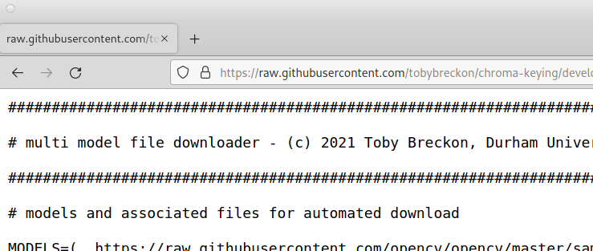

# Invisibility Cloaking via Real-time Object Detection in Video

This extra tasks extends the _Harry Potter_ style **invisibility cloaking** to
use real-time object detection and segmentation (specifically a neural network
based technique known as **[Mask R-CNN](https://viso.ai/deep-learning/mask-r-cnn/)**.)


## Task Setup

Some quick steps to get you setup for object detection:


1. In the browser, download and save file the code file [invisible_objects.py](src/invisible_objects.py?raw=1) (left click mouse, __"Save Page As ..."__).



2. In the browser, download and save the file script file [download-model.sh](src/download-model.sh?raw=1) (left click mouse, __"Save Page As ..."__).


3. Open a command line Terminal (see image above) and enter the following command:
```
bash ./download-model.sh
```

You should now see some output as follows:


4.  Finally, open the file [invisible_objects.py](src/invisible_objects.py?raw=1) that you downloaded in Visual Studio Code (File menu -> Open File)


## Task 5 - Invisibility Cloaking via Object Detection

In this extra exercise, we make use of a deep machine learning based object detection model, specifically a Mask Region-based Convolutional Neural Network ([Mask R-CNN](https://viso.ai/deep-learning/mask-r-cnn/)). This model has been pre-trained to detect upto 90 different types of object, including people, using 1000's of labelled image examples. The Mask R-CNN model takes a input image (e.g. from the camera) and produces object detections in the form of bounding boxes (i.e. regions), object masks showing the pixels in the image that belong to the object and also class (or type) labels saying what the object is.


Here we make use of a pre-trained model to be able to detect object masks within the image. We can then use these R-CNN generated object masks as the _foreground mask_ for our invisibility cloaking approach in place of using the green material.

To try this out:
- run the downloaded code file [invisible_objects.py](src/invisible_objects.py?raw=1)
(click _"Run > Run Without Debugging"_)
- you should now see 2 image windows displayed - one containing an initial background image, and one containing the mask output of the Mask R-CNN model (with each type of object over-shaded with a different colour)

As before, you you can reset the background image by _pressing the space key_ but now you can _press the **i key to turn on invisibility**_ for the detected objects in the scene.

However, **you may notice the program is running very slowly and sluggishly**. This is because of all the processing required to 


- opencv.init


You should now see a scene where .....

### How does this work ?

This approach is using a trained object detection and segmentation model known as a [Mask Region-Based Convolutional Neural Network](https://viso.ai/deep-learning/mask-r-cnn/) ....

.....

.....

### Some other things to try ...

If time allows you may want to try extending this code with the following features:
- ....
- .... edit classes file ... (remove lines, make copy first - can always re-download)
- ....
- ....


## Additional Info

**Instructor Notes:** tested with [OpenCV](https://opencv.org) 4.6.x. (08/2022) on Durham University LDS (Debian Linux) + OpenSuSE Linux Tumbleweed.

**Developer Notes:** to add - additional versions with sliders controls for object confidence, perhaps.

**Acknowledgements:** based in part on a prior code example from the [OpenCV Library]( https://github.com/opencv/opencv/blob/master/samples/dnn/mask_rcnn.py).
