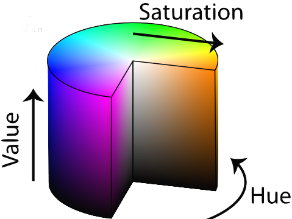

# Colour Selection and Filtering in Real-time Video

This repository contains a set of computer science taster coding excercises for colour filtering from a live video image, including Harry Potter style invisibility cloaking. It is designed to give you a starter experience in Python coding and real-time image manipuluation.

## Getting Started

Four quick steps to get you started:

1. Ensure the computer is booted into Linux
2.  Login with the provided username and password
3.  Start Visual Studio Code (Menu: Applications > Programming > Visual Studio Code)
4.  Within Visual Studio Code select menu item: File > New File
    * Click _"Selection a language"_ and choose _"Python"_
    * It will then say _"Do you want to install the recommended extensions for Python?"_
    * Click _"Install"_ and wait ~1 minute whilst everything is setup for you

**You are now ready to start coding** - make sure you have all the supporting materials to hand, and go to **Task 1**

#### Supporting Materials

_[ All supplied if you doing this as a visitor to [Computer Science at Durham University](https://www.durham.ac.uk/departments/academic/computer-science/) ]_

- a Linux PC with [OpenCV](https://www.opencv.org) and [Visual Studio Code](https://code.visualstudio.com/) installed
- 1 x USB webcam (that works under Linux with the UVC driver)
- 1 x green covered chroma-keying material

## Task 1 - Capture a Live Camera Image

Once you have completed the **Getting Started** steps:

- copy and paste the code from this example [capture_camera.py](capture_camera.py) into your Visual Studio Code window
- save this file as ```main.py``` by selecting menu item: File > Save As... (then entering filename as ```main.py```)
- _[ make sure your usb webcam is connected to your PC ]_
- click _"Run > Run Without Debugging"_, you should see a window with an image captured

You should now see a live image from your webcam, _if not_ and you get an error try plugging/re-plugging the usb webcam a couple of times and re-run the program (last step above).

You may now also wish to try the following:

- re-orienting the image if it is upside down or back to front (left-right): find the function ```cv2.flip(image,-1)``` in the code and uncomment it. The number in the brackets controls what sort of flip is done. Try changing it to 0 or 1, to get a correct orientation for your image, then try other numbers to see the effect.
- adding blurring to the image to remove image noise: find the line containin ```cv2.GaussianBlur(...)``` in the code and uncomment it. The specified filter sizes, _(5,5)_, which are known an parameters to the blurring function control how much blurring is performed in each of the horizontal (_x_-axis) and vertical (_y_-axis) directions in the image: you can try varying them for differing effects and re-running your code but the parameters you use must be _positive, odd_ numbers.

**Advanced:** you may wish to try this example [live_video.py](live_video.py) which does image blurring on a live video image from the camera with graphical user interface (GUI) sliders to control the blurring on the live image. To try it, copy and paste it over your earlier code in the Visual Studio Code window, save it, and then run it (click _"Run > Run Without Debugging"_) as before. You may wish to also add in the earlier image flipping ```cv2.flip(....)``` or other [filtering effects from the OpenCV library](https://docs.opencv.org/4.x/d2/d96/tutorial_py_table_of_contents_imgproc.html).


## Task 2 - Identifying an Image Region by Hue

Computers normally store an image as a giant matrix with three values for each pixel: the intensity of Red, Green and Blue (RGB values) that combine to make the colour of a pixel. RGB values are a simple but fairly robust method of identifying an object is by colour. However you want to specify the colour in a way that isn't too much affected by how light or dark the lighting on the object is, or how washed out or exposed the image is. This is tricky when specifying ranges of RGB values, but can be done by looking at the hue of the object.

[ to come directly from Magnus's 2nd task here + add colour picker for Hue ]

**Advanced:** [ existing RGB  / HSV viewers from Toby IP examples ]

## Task 3 - Building an Invisibility Cloak

[ use the basic code from original blog / Chris email ]

**Advanced:** [ sliders for the various parameters ]

## Task 3 - Building an Improved Invisibility Cloak

[ add colour selector, histogram back-projection to image (?), alpha blending (?) etc ]

**Advanced:** [ sliders for the various parameters ]

## Bonus Task - Machine Learning Based Invisibility

[ use pre-trained Mask R-CNN, detect people as masks based on Toby's existing CV teaching example - then feed that into the earlier invisibility "engine" of Task 3]

**Advanced:** [ change the selected object ]

*Acknowledgements:* based on a prior set of exercises by [Magnus Bordewich](https://github.com/MagnusBordewich/ObjectTracking/), prior image processing teaching examples by [Toby Breckon](https://github.com/tobybreckon/python-examples-ip/) and the inspirational blog post of [Puranjay Kwatra](https://www.analyticsvidhya.com/blog/2021/07/harry-potters-invisible-cloak-using-opencv-python/).
