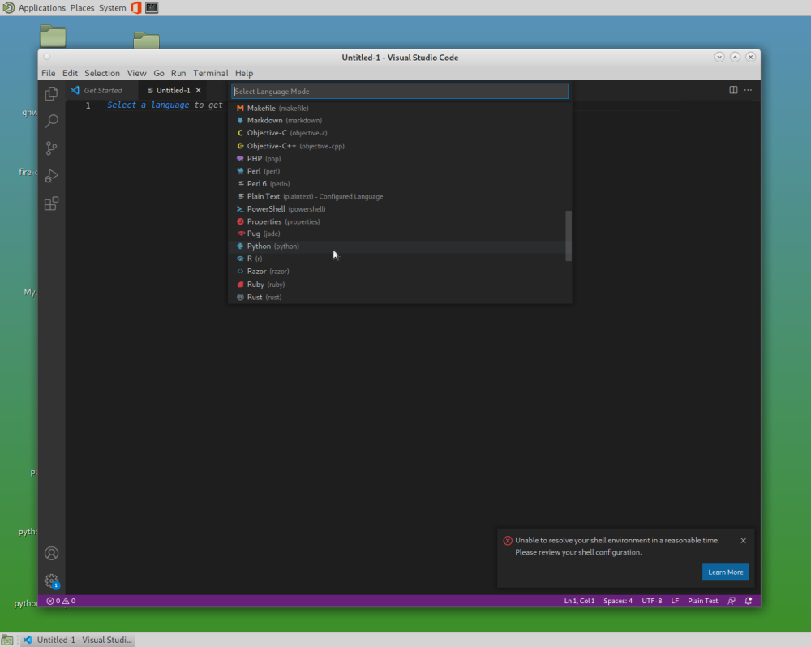
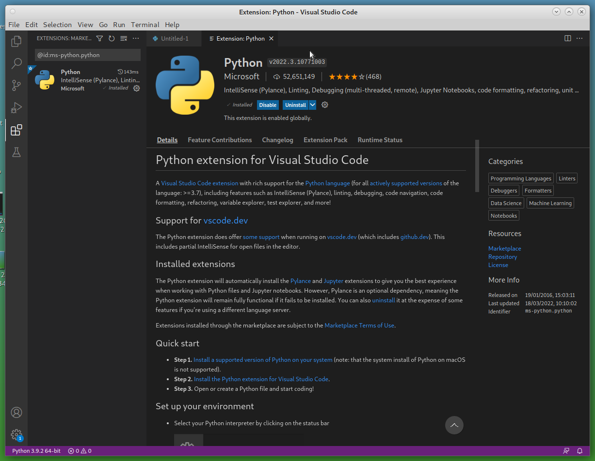
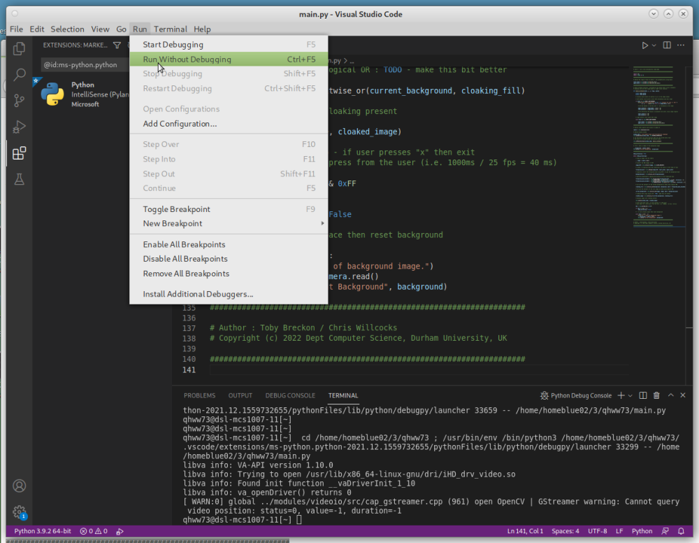
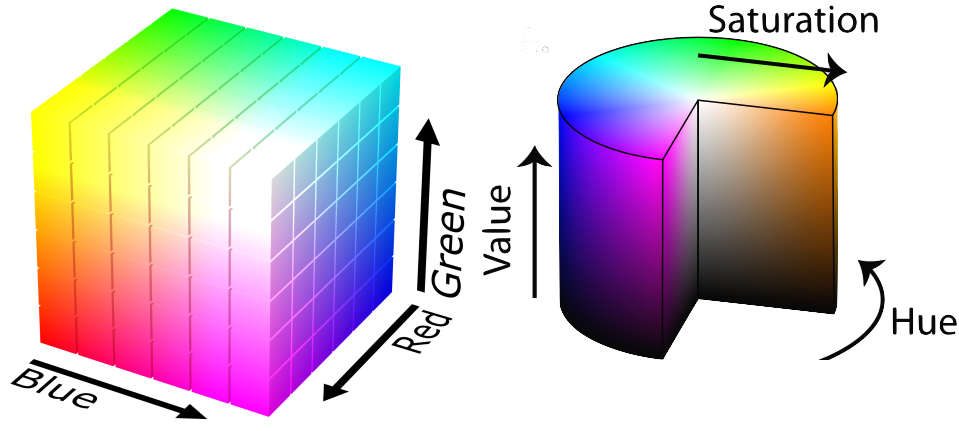
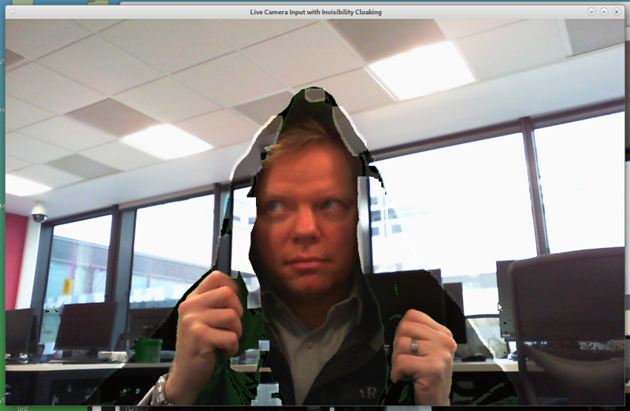

# Colour Selection and Filtering in Real-time Video

This repository contains a set of computer science taster coding exercises for colour filtering from a live video image, including _Harry Potter_ style invisibility cloaking via a technique known as chroma keying. It is designed to give you a starter experience in Python coding and real-time image manipulation.

## Getting Started



Four quick steps to get you started:

1. Ensure the computer is booted into Linux
2.  Login with the provided username and password
3.  Start Visual Studio Code (Menu: Applications > Programming > Visual Studio Code)
4.  Within Visual Studio Code select menu item: File > New File
    * Click _"Selection a language"_ and choose _"Python"_
    * It will then say _"Do you want to install the recommended extensions for Python?"_
    * Click _"Install"_ and wait ~1 minute whilst everything is setup for you



**You are now ready to start coding** - make sure you have all the supporting materials to hand, and go to **Task 1**

#### Supporting Materials

_[ All supplied if you doing this as a visitor to [Computer Science at Durham University](https://www.durham.ac.uk/departments/academic/computer-science/) ]_

- a Linux PC with [OpenCV](https://www.opencv.org) and [Visual Studio Code](https://code.visualstudio.com/) installed
- 1 x USB webcam (that works under Linux with the UVC driver)
- 1 x green covered chroma keying material

## Task 1 - Capture a Live Camera Image

Once you have completed the **Getting Started** steps:

- copy and paste the code from this example [capture_camera.py](src/capture_camera.py) into your Visual Studio Code window
- save this file as ```main.py``` by selecting menu item: File > Save As... (then entering filename as ```main.py```)
- _[ make sure your usb webcam is connected to your PC ]_
- click _"Run > Run Without Debugging"_



- you should see a window with an image captured from the camera displayed.

You should now see a live image from your webcam, _if not_ and you get an error try plugging/re-plugging the usb webcam a couple of times and re-run the program (last step above).

You may now also wish to try the following:

- re-orienting the image if it is upside down or back to front (left-right): find the function ```cv2.flip(image,-1)``` in the code and uncomment it. The number in the brackets controls what sort of flip is done. Try changing it to 0 or 1, to get a correct orientation for your image, then try other numbers to see the effect.
- adding blurring to the image to remove image noise: find the line containin ```cv2.GaussianBlur(...)``` in the code and uncomment it. The specified filter sizes, _(5,5)_, which are known an parameters to the blurring function control how much blurring is performed in each of the horizontal (_x_-axis) and vertical (_y_-axis) directions in the image: you can try varying them for differing effects and re-running your code but the parameters you use must be _positive, odd_ numbers.

**Advanced:** you may wish to try this example [live_video.py](src/live_video.py) which does image blurring on a live video image from the camera with graphical user interface (GUI) sliders to control the blurring on the live image. To try it, copy and paste it over your earlier code in the Visual Studio Code window, save it (File > Save), and then run it (click _"Run > Run Without Debugging"_) as before.  _[ you can exit the program by pressing ```x``` ]_

By varying the filter sizes you can also observe the impact on the processing time required to blur the image in the test in the top left of the image display (_more blurring => more computation required => more time required to process each image => slower processing_). You may wish to also add in the earlier image flipping ```cv2.flip(....)``` or other [filtering effects from the OpenCV library](https://docs.opencv.org/4.x/d2/d96/tutorial_py_table_of_contents_imgproc.html).


## Task 2 - Identifying an Image Region by Hue

Computers normally store an image as a giant matrix with three values for each pixel: the intensity of Red, Green and Blue (RGB values) that combine to make the colour of a pixel. RGB values are a simple but fairly robust method of identifying an object is by colour. However you may want to specify the colour in a way that isn't affected by how light or dark the lighting on an object is, or how washed out or exposed the image then thi can be tricky when specifying ranges of RGB values in order to identify image regions (diagram below, left). However, it can be done by looking at the Hue (primary colour/wavelength) of the object by transforming the RGB image to a Hue, Saturation and Value (HSV) representation (diagram below, right).



- copy and paste the code from this example [hsv_colour.py](src/hsv_colour.py) into your Visual Studio Code window (replacing all earlier code) again save (File > Save)
- hold up the (green) chroma keying material and run it (click _"Run > Run Without Debugging"_)
- you should see a grey image displayed but with the green material colour retained (in green)
- _[ you can exit the program by pressing any key ]_

_If it doesn't work for you, you may need to adjust the range settings for the Hue value (first value of array) to get the correct range of green Hue, in the code lines:_

```
lower_green = np.array([75,50,50])
upper_green = np.array([100,255,255])
```

### How does this work ?

The function ```cv2.cvtColor(image, cv2.COLOR_BGR2HSV)``` converts the image representation from three RGB values for each pixel, to a Hue, Saturation and Value value for each pixel. Hue give the essential colour (approx. equivalent to the wavelength), Saturation gives the intensity of that colour and Value gives the overall brightness of the colour at that pixel.

By specifying a tight range of Hue values, and a very wide range of Saturation and Value values, we can identify all regions that contain objects of a given colour in the image, regardless of lighting conditions. The print statement in the program will output the HSV values of the centre pixel of the image to the terminal.

The variables ```lower_green``` and ```upper_green``` in the program are used to specify Hue between 75 and 100, which is roughly the green of the chroma keying material, and Saturation and Value values between 50 and 255 (i.e. ignore low intensity, poor brightness areas but keep everything else up to a strong and bright green colour).

The function ```cv2.inRange(...)``` is used to create a mask - an image of 0s and 255s with 255s where the corresponding pixel was sufficiently green, and a 0 elsewhere. We then also create an opposite mask (```mask_inverted```), by swapping 0s and 255s. 0 and 255 are used, because when interpreted as a greyscale image, this gives a black and white (binary) mask. The masks are used to make two images - one where we convert the original image to greyscale, then do a bit-wise logical AND (```bitwise_and()```) with the inverted mask to keep only pixels that were not green, and another from a bit-wise logical AND of the original image and the mask to keep only the green pixels. Combining these gives an image where green parts are kept but everything else is greyscale.

## And now with point and click ....

In order to make this approach easier to use we can add a point and click colour selector via the use of a mouse callback function, and combine this with our earlier live camera video display code.

To try this out:

- copy and paste the code from this example [hsv_colour_select.py](src/hsv_colour_select.py) into your Visual Studio Code window (replacing all earlier code) again save (File > Save)
- hold up the (green) chroma keying material and run it (click _"Run > Run Without Debugging"_)
- you should initially see a live colour image from the camera; _left click_ on any object to select its Hue
- you should now see a grey image displayed but with the Hue colour that you selected retained (for example just the green of the chroma keying material)
- _[ you can exit the program by pressing ```x``` ]_

You may wish to look at the mouse callback function (see ```mouse_callback()``` in the code), and uncomment the functionality for resetting the HSV ranges on right mouse click.

**Advanced:** If you want to understand more about how images are constructed using RGB or HSV colour representations you may find these corresponding [rgb_viewer.py](src/rgb_viewer.py) and [hsv_viewer.py](src/hsv_viewer.py) interesting. Run them as before through Visual Studio Code, with the webcam attached. You can note how objects of certain colours (e.g. green) appear brighter in the corresponding channels in corresponding the RGB channels (yet appear in all 3), and similarly vibrant colours have

## Task 3 - Building an Invisibility Cloak



From all of the image processing functionality we have built up so far, we can now build _Harry Potter_ style invisibility cloaking in software using a technique known as [chroma keying]().

To try this out:
- copy and paste the code from this example [invisibility_cloak.py](src/invisibility_cloak.py) into your Visual Studio Code window (replacing all earlier code) again save (File > Save)
- point your webcam to a clear(ish) area of the room with no people or (green) chroma keying material in view; and run the code (click _"Run > Run Without Debugging"_)
- _[ a window of the current background image captured by the code should be displayed in one window, and the live image view in another ]_
- bring the (green) chroma keying material into view and _left click_ on it to select its Hue as before

You should now see objects that are covered by the chroma keying material are cloaked using information background from the captured scene background image.


You can reset the background image by _pressing the space key_; you can _right click_ to reset the Hue selection

### How does this work ?

When the program starts up, it stores an initial image of the clear area of the room with no people or (green) chroma keying material in view. This is our _background_ image.

Next, we use our earlier approach to isolate the image region with a green Hue, as a mask - an image of 0s and 255s with 255s where the corresponding pixel was sufficiently green, and a 0 elsewhere. We call this the _foreground mask_ as it contains the camera image region that we wish to make invisible.  By inverting our _foreground mask_ using a bit-wise logical NOT operation (```bitwise_not()```), we can obtain a _background mask_ that conversely contains the camera image region that we do not wish to make invisible.

Now, by performing a bit-wise logical AND operation between our _foreground mask_ and our original _background_ image we can isolate the pixels from the _background_ image that need to be used to cloak the image region with a green Hue (```cloaking_fill```). Similarly, by performing a bit-wise logical AND operation between the camera image and the _background mask_ we can identify the region of camera image that does not need to be cloaked (```current_background```). By combining the output of these two AND operations, we can obtain our cloaked image via the use of a bit-wise logical OR operation (```bitwise_or()```).

As bit-wise logical operations such as NOT, AND and OR can be performed on large matrices of binary data, such as images, at high-speed by a modern CPU we can obtain real-time image cloaking.

_Details_: In order to clean up the _foreground mask_ region we perform a couple of morphological operations on the binary mask image to clean up the boundary of the foreground region and remove small holes in it due to imperfections in the selection of the green Hue pixels of the material. You can adjust the parameters of these operations in the code lines ```cv2.morphologyEx(....)``` by changing the number of iterations used both for morphological closing (see ```cv2.morphologyEx(..., cv2.MORPH_OPEN, ...)```) and dilation (see ```cv2.morphologyEx(..., cv2.MORPH_OPEN, ...)```). You can read more about morphological image operations [here](https://homepages.inf.ed.ac.uk/rbf/HIPR2/morops.htm).

###  Improving our Invisibility ....

In order to improve our cloaking approach, we are now going to introduce a couple of core concepts from computational geometry and imaging:

- **convex hull**: at the moment the cloaked region is often broken up by internal areas where the isolation of Hue colour is poor or where the chroma keying material is not fully covering the object. One way around this is to automatically extract the exterior contour around all of the _foreground mask_ pixels, and then fill this entire region with 255s to update the mask. In computationally geometry, we call this the convex hull of the set of pixels that make up the original _foreground mask_.

- **feathered blending**: 

[ convex hull of largest contour, alpha blending (?) etc ]

## Bonus Task - Chroma Keying for Real ...

[ put yourself in front of a false background using an inverse to the invisibility cloak appraoch ...]

**Advanced:** [ change the selected object ]

*Acknowledgements:* based on a prior set of exercises by [Magnus Bordewich](https://github.com/MagnusBordewich/ObjectTracking/), prior image processing teaching examples by [Toby Breckon](https://github.com/tobybreckon/python-examples-ip/) and the inspirational blog post of [Puranjay Kwatra](https://www.analyticsvidhya.com/blog/2021/07/harry-potters-invisible-cloak-using-opencv-python/).
